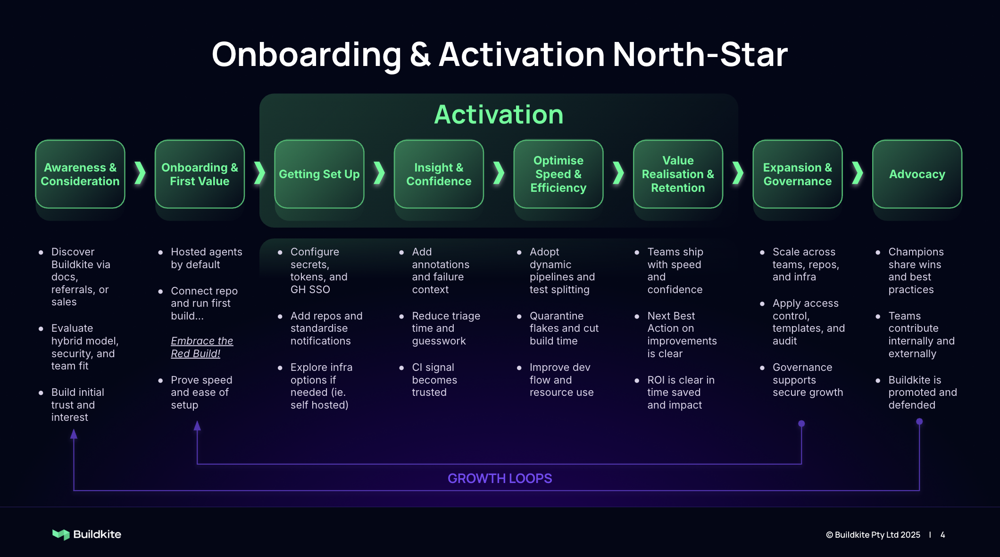

# Customer Journey Phases

Organise product strategy around how customers actually experience the product — not around your org chart. The six phases below are a generic framework; **rename, split, or collapse them to fit your product**. The shape is what matters: a customer goes from "never heard of you" to "tells other people about you," and your strategy should know where each phase's friction lives.

**How this is used:** Strategic levers in the RFC map to journey phases — Acquisition ≈ Phases 1–2, Retention ≈ Phases 3–4, Expansion ≈ Phase 5. See [RFC guide — Strategic Alignment](/productos-site/guides/product-specs/) for details.

---

## What a good customer journey looks like

- **5–7 phases.** Too few hides friction; too many becomes a wireframe.
- **One outcome per phase.** "The customer believes X" or "the customer can do Y." If a phase has three outcomes, it's actually three phases.
- **One or two leading metrics per phase.** Measure the *transition* into the next phase, not generic engagement.
- **Phases match what the customer feels**, not your internal funnel labels (MQL → SQL → etc.). Internal funnels go on a different diagram.

When is it done?
- [ ] Each phase has a name, a one-line "what happens," an outcome, and a metric or signal.
- [ ] You can point at every in-flight project and say which phase it's improving.
- [ ] You can point at one phase that's clearly weakest *and* one team accountable for it.

---

## How to adapt the framework

1. **Start at the end.** Phase 6 is *Advocacy* in this template — what does winning look like in your product? Word-of-mouth? Renewal? Community contribution? Pick one.
2. **Walk backwards.** What has to be true before a customer advocates? That's Phase 5. Before that? Phase 4. Continue until you reach "never heard of us" — that's Phase 1.
3. **Find the breakage.** Walk the journey with a customer success rep and a sales rep. Each will point at a different phase as "where we lose people." Both are right; pick the one your team is most accountable for and put it on the roadmap.
4. **Tie to strategic levers.** Each phase should map to one or more strategic levers (Acquisition, Activation, Retention, Expansion, Advocacy — pick the framing your strategy uses). RFCs cite the lever they're advancing.

---

## Phase Details (template)

> The phases below are written as a generic B2B SaaS journey. Replace the prose with what's true for your product.

### 1. Awareness & Consideration

**What happens:**
- Teams hear about the product through docs, referrals, search, or sales conversations
- They evaluate the model, posture, fit for their stack, and effort to try

**Outcome:** Initial trust and interest as a viable option

**Key questions:**
- "Is this better than what I have now?"
- "Will it work for my stack and constraints?"
- "What's the effort to try it?"

---

### 2. Onboarding & First Value

**What happens:**
- Customer signs up, completes the first meaningful action, sees a successful outcome
- First experience of speed and simplicity

**Outcome:** Early success proves the product works as promised

**Key metrics (examples):**
- Time to first successful action (target: p50 < your-number)
- First feedback / result time (target: < your-number)

---

> **Why 3A/3B/3C?** Phase 3 often covers multiple distinct journeys with different metrics and teams: setup, trust-building, and optimisation. Teams may progress at different speeds or skip sub-phases entirely. Split or combine as fits your product.

### 3A. Getting Set Up

**What happens:**
- Users configure auth, secrets, integrations, notifications
- They scale usage across teams and explore advanced capabilities if needed

**Outcome:** Deliberate setup replaces defaults; secure foundation laid

**Key questions:**
- "How do I manage secrets / auth safely?"
- "How do I connect to my identity provider?"
- "When do I move to advanced configuration?"

---

### 3B. Insight & Confidence

**What happens:**
- Teams add in-context guidance, runbooks, or other supporting material
- Failures become easier to diagnose and act on
- The signal becomes trusted

**Outcome:** Output becomes trusted and actionable

**Key metrics:**
- Time to understand failure (target: < your-number)
- User confidence in the product's signal

---

### 3C. Optimise Speed & Efficiency

**What happens:**
- Teams adopt advanced features that reduce friction or improve performance
- Time-to-outcome decreases; waste eliminated

**Outcome:** Faster, more efficient use of the product

**Key metrics (examples):**
- Time-to-outcome improvement (target: your %)
- Error / flake / retry rate (target: < your %)

---

### 4. Value Realisation & Retention

**What happens:**
- The product becomes embedded in the team's daily workflow
- Teams ship faster / operate more confidently / save measurable time

**Outcome:** ROI is visible in the customer's own metrics

**Key signals:**
- Daily / weekly usage is sticky
- Teams advocate internally
- Low churn risk

---

### 5. Expansion & Governance

**What happens:**
- The product is adopted across more teams, accounts, or workloads
- Governance features (audit logs, access controls, policy) are enabled

**Outcome:** Platform scales securely and consistently across the org

**Key metrics:**
- # of teams / orgs / workloads using the product
- Governance feature adoption

---

### 6. Advocacy

**What happens:**
- Champions contribute internal docs, onboarding resources, and success stories
- Some participate in external case studies or community enablement

**Outcome:** The product becomes a tool teams promote and advocate for

**Key signals:**
- Internal champions identifiable
- Referrals and case study participation
- Community contributions
